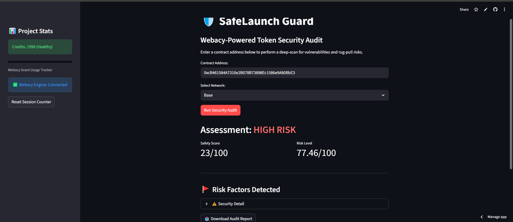

# 🛡️ SafeLaunch-Guard


**Building the future of Web3 Security with the Webacy Risk Engine.**

SafeLaunch-Guard provides real-time security auditing for token launches, helping users identify rug pulls and malicious contracts before they invest.

## 🚀 Key Features
* **Concentration Alerts:** Identifies if the Top 10 holders or Developers control a dangerous amount of the total supply.
* **Multi-Chain Support:** Native support for Base, Solana, Ethereum, and Polygon.
* **Webacy Integration:** Powered by the Webacy Risk Engine for enterprise-grade security data.

## 🛠️ Tech Stack
* **Language:** Python 3.9+
* **Framework:** Streamlit (UI)
* **API:** Webacy Risk Engine (Trading Intelligence)
* **Security:** Managed via `.env` for secure API key handling.

## 📦 Installation & Setup

1. **Clone the repository:**
   ```bash
   git clone [https://github.com/Prince-Chinedu123/SafeLaunch-Guard.git](https://github.com/Prince-Chinedu123/SafeLaunch-Guard.git)
   cd SafeLaunch-Guard
Install dependencies:
...bash
pip install streamlit requests python-dotenv

Configure Environment Variables: Create a .env file in the root directory:
WEBACY_API_KEY=your_api_key_here

Run the Application
....bash
streamlit run app.py

📺 Project Demos
🚀 Phase 2: Live Integration & Code Walkthrough (Current)
Watch the Demo Video:https://drive.google.com/file/d/1_LnprrYCnmyb_xqb_cwFKiLXxZhLhMcz/view?usp=drive_link

What's new: API integration, custom Safety Score logic, and a deep dive into the app.py architecture.

🎨 Phase 1: Initial Design & UI Concept
Watch the Concept Video:https://drive.google.com/file/d/1sIXn6O4ZkBXnZguGlROt-tzX4P-4gaRq/view?usp=drive_link

Goal: Early-stage mockup showing the user interface and vision for SafeLaunch Guard.

📅 Project Roadmap
Q1 2026: Initial integration with Webacy Risk Engine (Complete).

February 10, 2026: Official Public Launch & Community Beta.

Q2 2026: Implementation of "Safety Badge" API for new token launches.

Q3 2026: Expansion to automated Telegram & Discord security bots.

Built by Chinedu Prince Ogbu for the Webacy / DD.xyz Ecosystem.

## 📸 App Gallery & Demos

### 🟢 Safe Asset Audit (USDC on Ethereum)

*Result: Low Risk, 90/100 Safety Score.*

### 🔴 High Risk Audit (Malicious Contract on Base)

*Result: High Risk, 77.46 Risk Score. Identified vulnerabilities in contract logic.*


